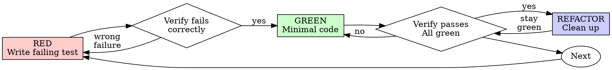

# Test-Driven Development (TDD)

## Overview

Write the test first for behavior changes. Watch it fail. Write minimal code to pass.

**Core principle:** If you didn't watch the test fail, you don't know if it tests the right thing.

**Do not invent low-value tests just to satisfy process.** If a change is not behavioral, use the right validation instead.

## When to Use

**Always use TDD for behavior:**
- New features
- Bug fixes
- Refactoring
- Behavior changes
- Business rules
- Data transformations
- Error handling
- Public APIs or user-visible flows

**TDD is usually not required for non-behavioral changes:**
- Infrastructure declarations, such as Terraform resources, queues, buckets, IAM bindings, DNS records, or Kubernetes manifests
- Dependency additions, removals, or version changes
- Configuration files and framework wiring
- Generated code
- Build, packaging, or metadata-only changes
- Documentation-only changes

For these changes, do not create unit tests that only assert file text, resource names, or configuration structure. Run the appropriate validation instead, such as schema validation, formatter checks, lint, typecheck, `terraform validate`, or a safe plan/build command.

**Exceptions that still need tests:**
- Infrastructure or config generation logic
- Code that chooses configuration at runtime
- Code that maps environment variables to behavior
- Wrappers around cloud services, APIs, datastores, queues, or SDK clients

**Ask your human partner when:**
- Throwaway prototypes
- CI cannot access a required external dependency and no meaningful local test double exists
- The only possible test would assert implementation text rather than behavior
- You are unsure whether the change is behavioral

Thinking "skip TDD just this once" for a behavior change? Stop. That's rationalization.

## Testing Decision Gate

Before writing or skipping tests, classify the change:

| Change type | What to do |
| ----------- | ---------- |
| Behavior change | Use Red-Green-Refactor. Watch the test fail first. |
| Bug fix | Write a failing regression test first. |
| Refactor preserving behavior | Prefer existing tests. Add characterization tests first if coverage is missing. |
| Infrastructure/config/dependency-only | Do not force unit tests. Run validation appropriate to the tool. |
| External API/datastore/queue integration | Use dependency injection plus fakes or integration tests if CI access exists. |
| Test requires monkey patching | Redesign for dependency injection, interfaces, factories, or adapters. |
| Test only checks file text | Do not write it unless parsing/rendering that text is the behavior under test. |

If tests are skipped, state why and list the validation performed.

## The Iron Law

```
NO BEHAVIORAL PRODUCTION CODE WITHOUT A FAILING TEST FIRST
```

Write behavioral code before the test? Delete it. Start over.

**No exceptions:**
- Don't keep it as "reference"
- Don't "adapt" it while writing tests
- Don't look at it
- Delete means delete

Implement behavioral changes fresh from tests. Period.

Non-behavioral infrastructure, dependency, configuration, or generated-code changes are outside the Iron Law when validation is more meaningful than unit tests.

## Red-Green-Refactor



### RED - Write Failing Test

Write one minimal test showing what should happen.

<Good>
```typescript
test('retries failed operations 3 times', async () => {
  let attempts = 0;
  const operation = () => {
    attempts++;
    if (attempts < 3) throw new Error('fail');
    return 'success';
  };

  const result = await retryOperation(operation);

  expect(result).toBe('success');
  expect(attempts).toBe(3);
});
```
Clear name, tests real behavior, one thing
</Good>

<Bad>
```typescript
test('retry works', async () => {
  const mock = jest.fn()
    .mockRejectedValueOnce(new Error())
    .mockRejectedValueOnce(new Error())
    .mockResolvedValueOnce('success');
  await retryOperation(mock);
  expect(mock).toHaveBeenCalledTimes(3);
});
```
Vague name, tests mock not code
</Bad>

**Requirements:**
- One behavior
- Clear name
- Real code and real assertions
- No monkey patching or module patching
- No mocks unless the dependency is external, slow, nondeterministic, or impossible to run locally

## Testable Design Requirements

If a test requires monkey patching, import patching, global state mutation, or complex mock setup, stop and improve the design first.

Prefer these seams:

| Seam | Use when |
| ---- | -------- |
| Dependency injection | A function/class needs an external client, clock, filesystem, queue, datastore, or API. |
| Interface/protocol/strategy | Production and test implementations must share a contract. |
| Factory | Runtime environment chooses the concrete implementation. |
| Adapter | Third-party SDK calls need a thin boundary around them. |
| Fake implementation | Tests need deterministic behavior without patching globals. |

<Good>
```python
class UserClient:
    def fetch_user(self, user_id: int) -> dict: ...

def get_user_profile(user_id: int, client: UserClient) -> dict:
    return client.fetch_user(user_id)

class FakeUserClient:
    def fetch_user(self, user_id: int) -> dict:
        return {"id": user_id, "name": "Ada"}

def test_get_user_profile_returns_user():
    result = get_user_profile(42, FakeUserClient())

    assert result["name"] == "Ada"
```
Dependency passed explicitly; no monkey patching
</Good>

<Bad>
```python
@patch("app.api_client.fetch_user")
def test_get_user_profile(mock_fetch_user):
    mock_fetch_user.return_value = {"id": 42, "name": "Ada"}

    result = get_user_profile(42)

    assert result["name"] == "Ada"
```
Hardcoded dependency forced a patch
</Bad>

Factories are acceptable when production object creation must vary by environment:

```python
def notification_service_factory(env: str, client=None):
    if env == "test":
        return InMemoryNotificationService()
    return SqsNotificationService(client)
```

### Verify RED - Watch It Fail

**MANDATORY. Never skip.**

```bash
npm test path/to/test.test.ts
```

Confirm:
- Test fails (not errors)
- Failure message is expected
- Fails because feature missing (not typos)

**Test passes?** You're testing existing behavior. Fix test.

**Test errors?** Fix error, re-run until it fails correctly.

### GREEN - Minimal Code

Write simplest code to pass the test.

<Good>
```typescript
async function retryOperation<T>(fn: () => Promise<T>): Promise<T> {
  for (let i = 0; i < 3; i++) {
    try {
      return await fn();
    } catch (e) {
      if (i === 2) throw e;
    }
  }
  throw new Error('unreachable');
}
```
Just enough to pass
</Good>

<Bad>
```typescript
async function retryOperation<T>(
  fn: () => Promise<T>,
  options?: {
    maxRetries?: number;
    backoff?: 'linear' | 'exponential';
    onRetry?: (attempt: number) => void;
  }
): Promise<T> {
  // YAGNI
}
```
Over-engineered
</Bad>

Don't add features, refactor other code, or "improve" beyond the test.

### Verify GREEN - Watch It Pass

**MANDATORY.**

```bash
npm test path/to/test.test.ts
```

Confirm:
- Test passes
- Other tests still pass
- Output pristine (no errors, warnings)

**Test fails?** Fix code, not test.

**Other tests fail?** Fix now.

### REFACTOR - Clean Up

After green only:
- Remove duplication
- Improve names
- Extract helpers

Keep tests green. Don't add behavior.

### Repeat

Next failing test for next feature.

## Good Tests

| Quality          | Good                                | Bad                                                 |
| ---------------- | ----------------------------------- | --------------------------------------------------- |
| **Minimal**      | One thing. "and" in name? Split it. | `test('validates email and domain and whitespace')` |
| **Clear**        | Name describes behavior             | `test('test1')`                                     |
| **Shows intent** | Demonstrates desired API            | Obscures what code should do                        |

## Tests Not To Write

Do not add tests that only prove source text exists:

<Bad>
```typescript
test('creates queue', () => {
  const terraform = readFileSync('queue.tf', 'utf8');

  expect(terraform).toContain('aws_sqs_queue');
  expect(terraform).toContain('orders_queue');
});
```
This tests text, not behavior. Use Terraform validation or plan review instead.
</Bad>

Appropriate alternatives:
- Run the infrastructure tool's validator or formatter
- Run a safe plan/diff command when credentials and environment allow it
- Add tests only for code that renders, transforms, or selects infrastructure/configuration
- Add integration tests only when CI can access the dependency safely

## Why Order Matters

**"I'll write tests after to verify it works"**

Tests written after code pass immediately. Passing immediately proves nothing:
- Might test wrong thing
- Might test implementation, not behavior
- Might miss edge cases you forgot
- You never saw it catch the bug

Test-first forces you to see the test fail, proving it actually tests something.

**"I already manually tested all the edge cases"**

Manual testing is ad-hoc. You think you tested everything but:
- No record of what you tested
- Can't re-run when code changes
- Easy to forget cases under pressure
- "It worked when I tried it" ≠ comprehensive

Automated tests are systematic. They run the same way every time.

**"Deleting X hours of work is wasteful"**

Sunk cost fallacy. The time is already gone. Your choice now:
- Delete and rewrite with TDD (X more hours, high confidence)
- Keep it and add tests after (30 min, low confidence, likely bugs)

The "waste" is keeping code you can't trust. Working code without real tests is technical debt.

**"TDD is dogmatic, being pragmatic means adapting"**

TDD IS pragmatic:
- Finds bugs before commit (faster than debugging after)
- Prevents regressions (tests catch breaks immediately)
- Documents behavior (tests show how to use code)
- Enables refactoring (change freely, tests catch breaks)

"Pragmatic" shortcuts = debugging in production = slower.

**"Tests after achieve the same goals - it's spirit not ritual"**

No. Tests-after answer "What does this do?" Tests-first answer "What should this do?"

Tests-after are biased by your implementation. You test what you built, not what's required. You verify remembered edge cases, not discovered ones.

Tests-first force edge case discovery before implementing. Tests-after verify you remembered everything (you didn't).

30 minutes of tests after ≠ TDD. You get coverage, lose proof tests work.

## Common Rationalizations

| Excuse                                 | Reality                                                                 |
| -------------------------------------- | ----------------------------------------------------------------------- |
| "Too simple to test"                   | Simple code breaks. Test takes 30 seconds.                              |
| "I'll test after"                      | Tests passing immediately prove nothing.                                |
| "Tests after achieve same goals"       | Tests-after = "what does this do?" Tests-first = "what should this do?" |
| "Already manually tested"              | Ad-hoc ≠ systematic. No record, can't re-run.                           |
| "Deleting X hours is wasteful"         | Sunk cost fallacy. Keeping unverified code is technical debt.           |
| "Keep as reference, write tests first" | You'll adapt it. That's testing after. Delete means delete.             |
| "Need to explore first"                | Fine. Throw away exploration, start with TDD.                           |
| "Test hard = design unclear"           | Listen to test. Hard to test = hard to use.                             |
| "TDD will slow me down"                | TDD faster than debugging. Pragmatic = test-first.                      |
| "Manual test faster"                   | Manual doesn't prove edge cases. You'll re-test every change.           |
| "Existing code has no tests"           | You're improving it. Add tests for existing code.                       |

## Red Flags - STOP and Start Over

- Behavioral code before test
- Behavioral test after implementation
- Behavioral test passes immediately
- Can't explain why test failed
- Behavioral tests added "later"
- Rationalizing "just this once" for behavior
- "I already manually tested it"
- "Tests after achieve the same purpose"
- "It's about spirit not ritual"
- "Keep as reference" or "adapt existing code"
- "Already spent X hours, deleting is wasteful"
- "TDD is dogmatic, I'm being pragmatic"
- "This is different because..." when the change is behavioral

**For behavioral changes, all of these mean: Delete code. Start over with TDD.**

Skipping unit tests for non-behavioral infrastructure, dependency, configuration, generated-code, or documentation changes is not a red flag when appropriate validation is performed and documented.

## Example: Bug Fix

**Bug:** Empty email accepted

**RED**
```typescript
test('rejects empty email', async () => {
  const result = await submitForm({ email: '' });
  expect(result.error).toBe('Email required');
});
```

**Verify RED**
```bash
$ npm test
FAIL: expected 'Email required', got undefined
```

**GREEN**
```typescript
function submitForm(data: FormData) {
  if (!data.email?.trim()) {
    return { error: 'Email required' };
  }
  // ...
}
```

**Verify GREEN**
```bash
$ npm test
PASS
```

**REFACTOR**
Extract validation for multiple fields if needed.

## Verification Checklist

Before marking work complete:

- [ ] Classified the change as behavioral or non-behavioral
- [ ] For behavioral changes, every new behavior has a test
- [ ] For behavioral changes, watched each test fail before implementing
- [ ] For behavioral changes, each test failed for expected reason
- [ ] For behavioral changes, wrote minimal code to pass each test
- [ ] All tests pass
- [ ] Output pristine (no errors, warnings)
- [ ] Tests use real code and explicit dependencies when tests are present
- [ ] No monkey patching, module patching, or global import patching when tests are present
- [ ] Mocks are avoided; fakes/test doubles use interfaces or dependency injection when tests are present
- [ ] Behavioral edge cases and errors covered
- [ ] Non-behavioral changes use appropriate validation instead of forced unit tests
- [ ] If tests were skipped, the reason and validation command are documented

Can't check the behavioral boxes for a behavior change? You skipped TDD. Start over.

## When Stuck

| Problem                | Solution                                                             |
| ---------------------- | -------------------------------------------------------------------- |
| Don't know how to test | Write wished-for API. Write assertion first. Ask your human partner. |
| Test too complicated   | Design too complicated. Simplify interface.                          |
| Must mock everything   | Code too coupled. Use dependency injection, interfaces, or factories. |
| Must monkey patch      | Dependency creation is in the wrong place. Move it behind a seam.    |
| Test setup huge        | Extract helpers. Still complex? Simplify design.                     |
| Infra test asserts text | Delete it. Run tool validation or test the generator instead.        |

## Debugging Integration

Bug found? Write failing test reproducing it. Follow TDD cycle. Test proves fix and prevents regression.

Never fix bugs without a test.

## Testing Anti-Patterns

When writing tests, adding test utilities, or considering mocks, read @testing-anti-patterns.md for examples. The decisive rules are:
- Testing mock behavior instead of real behavior
- Adding test-only methods to production classes
- Mocking without understanding dependencies
- Monkey patching or module patching instead of using dependency injection
- Testing declarative infrastructure/configuration by asserting source text

Do not rely on this companion file being automatically loaded. Apply these rules from this skill even when the reference is not in context.

## Final Rule

```
Behavioral production code → test exists and failed first
Non-behavioral change → appropriate validation exists
Otherwise → not complete
```

No behavior exceptions without your human partner's permission.
